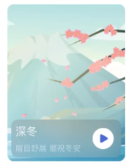
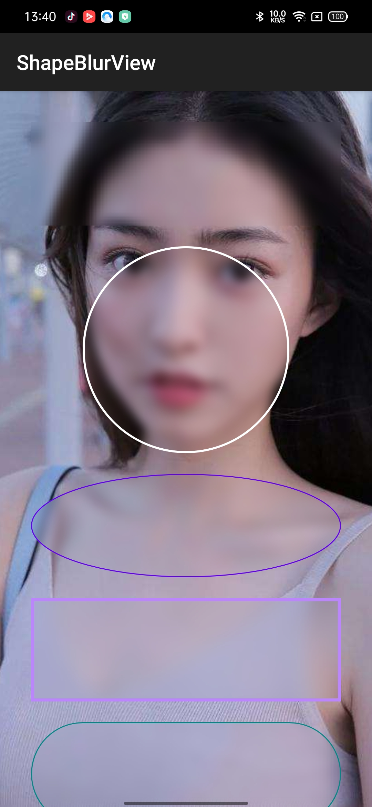
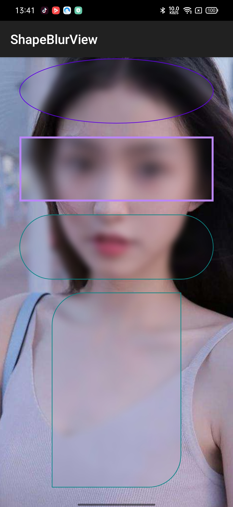

# ShapeBlurView
`ShapeBlurView`库是一个高斯模糊（毛玻璃效果）蒙层库。
不知大家做需求的时候是否有这样的效果要求：


大家熟悉的Android常用图片加载库，比如Glide 可以对图片进行毛玻璃效果的加载（实现不展开说了）
但是都是对整个要加载的图片进行高斯模糊效果，对应局部这种比较难处理，这个库就能实现这样的效果。
当然，你对整个图片盖一层，也能达到Glide高斯模糊加载的效果。
先看看效果：



网上有其他大神开源的库，但都有些美中不足。
**此`ShapeBlurView`库支持矩形、圆形、椭圆；边框、边框自定义颜色、自定义边框粗细；矩形时支持切圆角
并且可以支持对4个角分别切圆角。**

------
## 使用步骤
1、在添加maven地址的地方添加：
>repositories {
        maven { url 'https://jitpack.io' }
    }

2、在需要使用的gradle文件添加依赖：
```implementation 'com.github.centerzx:ShapeBlurView:1.0.0'```
```implementation 'androidx.appcompat:appcompat:***'```

appcompat:***根据你自己的版本添加

## 使用说明

### (1)Xml布局文件中引用

```
            <net.center.blurview.ShapeBlurView
                android:id="@+id/blurview"
                android:layout_width="300dp"
                android:layout_height="100dp" />
```
默认效果代码如上，当然width、height根据需求而定

### (2)可用属性
```
        <attr format="dimension" name="blur_radius"/>
        <attr format="float" name="blur_down_sample"/>
        <attr format="color" name="blur_overlay_color"/>
        <attr format="dimension" name="blur_corner_radius"/>
        <attr format="dimension" name="blur_corner_radius_top_left"/>
        <attr format="dimension" name="blur_corner_radius_top_right"/>
        <attr format="dimension" name="blur_corner_radius_bottom_left"/>
        <attr format="dimension" name="blur_corner_radius_bottom_right"/>
        <attr format="dimension" name="blur_border_width"/>
        <attr format="color" name="blur_border_color"/>
        <attr name="blur_mode">
            <enum name="rectangle" value="0"/>
            <enum name="circle" value="1"/>
            <enum name="oval" value="2"/>
        </attr>
```

>blur_radius:高斯模糊半径，值越大越模糊，0<r<=25
blur_down_sample:采样参数
blur_overlay_color:毛玻璃覆盖颜色
blur_corner_radius:矩形时圆角半径（4个角一样），其他几个corner属性大家应该能看懂
blur_border_width:边框线条宽度
blur_border_color:边框线条颜色
blur_mode:样式，rectangle：矩形；circle：圆形；oval：椭圆

### (3)代码中对熟悉进行设置

```
        blurview?.refreshView(
            ShapeBlurView.build().setBlurMode(BlurMode.MODE_RECTANGLE)
                .setCornerRadius(BlurCorner.TOP_LEFT, 50f).setBorderWidth(10f)
                .setBorderColor(
                    R.color.teal_200
                )
        )
```
调用类方法refreshView，使用简洁build模式进行值设置，最终只调用一次invalidate()
这样避免传统的setXXX方法里面设置一个值就去调用invalidate()进行重绘

### (4)项目开源地址

>[GitHub地址](https://github.com/centerzx/ShapeBlurView)


高斯模糊效果参考`RealtimeBlurView`库，感谢：[RealtimeBlurView](https://github.com/mmin18/RealtimeBlurView/)

项目库如有不足和错误的地方，欢迎大家讨论指正！
